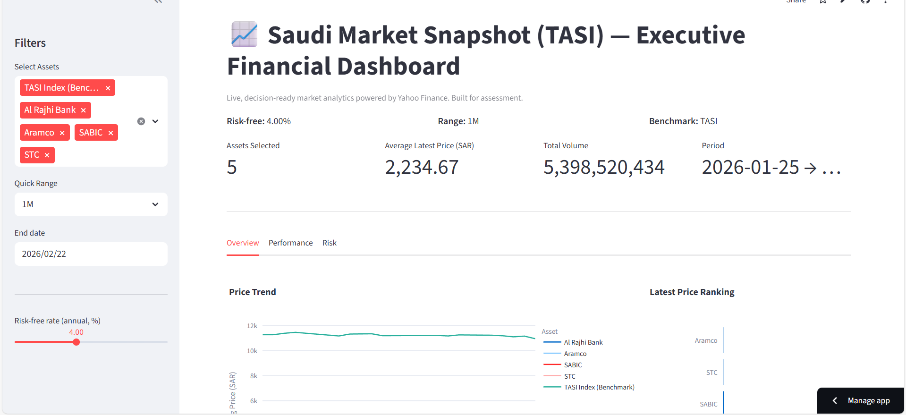
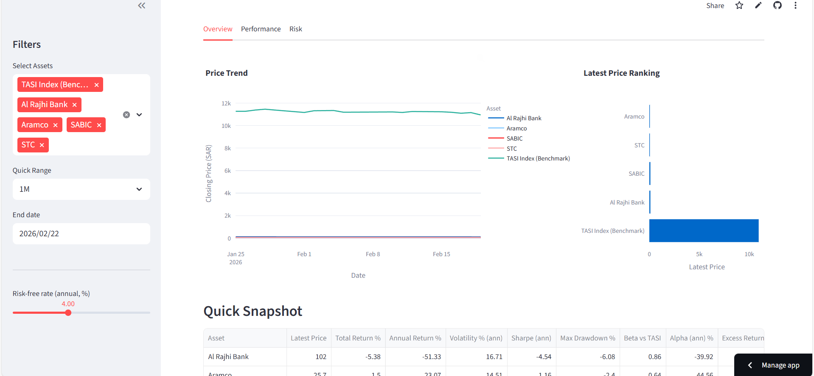
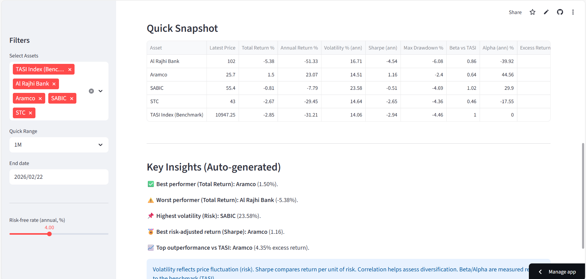
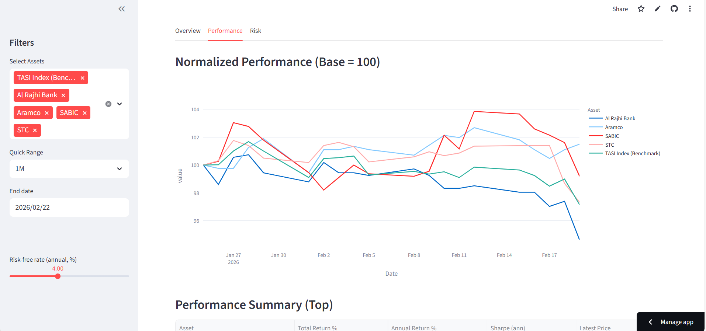
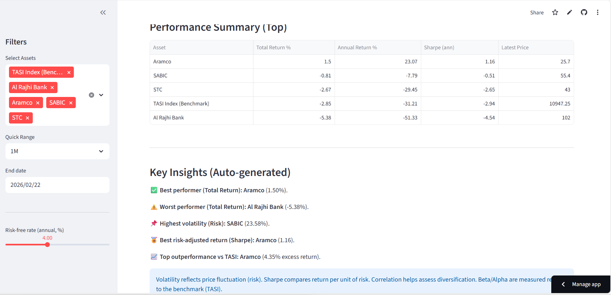
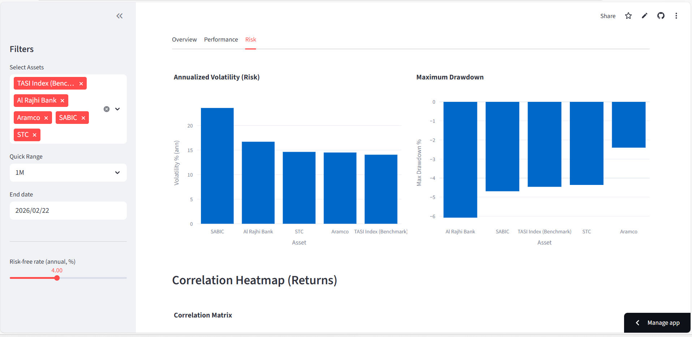
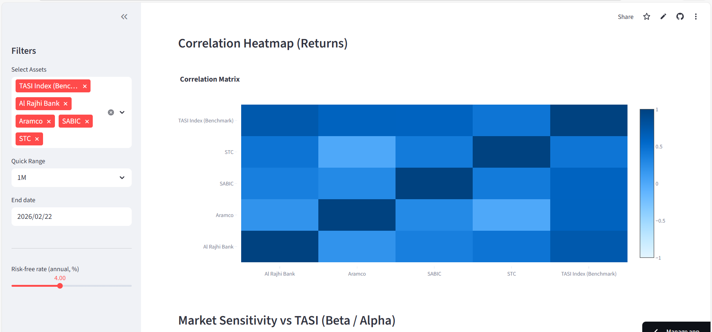
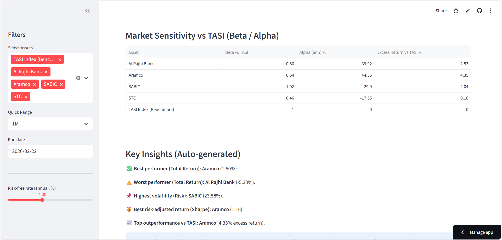
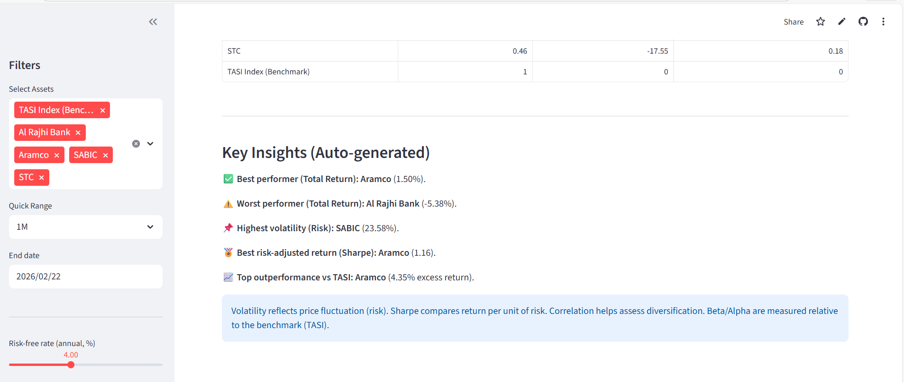

# Saudi Market Snapshot (TASI) — Executive Financial Dashboard

## Project Overview

This project presents a live executive-level financial dashboard analyzing selected Saudi market assets including TASI (benchmark), Al Rajhi Bank, Aramco, SABIC, and STC.

The main objective of this dashboard is to provide a decision-ready analytical view of market performance, risk exposure, and comparative asset behavior over time.

It is designed to answer the following business questions:
- How are selected Saudi blue-chip assets performing relative to TASI?
- Which assets currently lead in price ranking?
- What is the risk-return profile over the selected time horizon?
- How does market trading volume evolve across assets?

---

## Data Source

The financial data used in this dashboard is retrieved dynamically from Yahoo Finance using Python.

The dataset includes:
- Historical daily prices
- Trading volume
- Benchmark index data (TASI)
- Selected asset tickers

The time range is user-controlled and configurable within the dashboard interface.

---

## Methodology & Design Approach

The dashboard was built using Streamlit to ensure real-time interactivity and executive usability.

Steps followed:
1. Data retrieval via financial API
2. Data cleaning and transformation using pandas
3. Feature engineering (returns, volatility, comparative metrics)
4. Benchmark alignment with TASI
5. KPI calculation (average price, total volume, asset ranking)
6. Interactive visualization design using Plotly

Design principles applied:
- Executive clarity (minimal noise, high-signal visuals)
- Clear KPI hierarchy
- Controlled filtering for user-driven analysis
- Adjustable risk-free rate for scenario simulation

---

## Dashboard Screenshots

### Overview Tab

---

### Performance Tab

---

### Risk Tab

---

## Key Insights

- Asset price movement shows strong alignment with TASI benchmark trends.
- Sector leaders demonstrate differentiated volatility patterns.
- Risk-return distribution varies significantly across selected assets.
- Volume concentration suggests potential institutional trading activity.

---

## Assumptions & Limitations

- Data accuracy depends on Yahoo Finance API reliability.
- Market anomalies (corporate actions, splits) may influence historical interpretation.
- The dashboard is designed for analytical demonstration purposes within assessment scope.

---

## Live Dashboard

🔗 https://tarmeez-financial-dashboard-cr8akx9s5pesnrhqetrjq4.streamlit.app/
